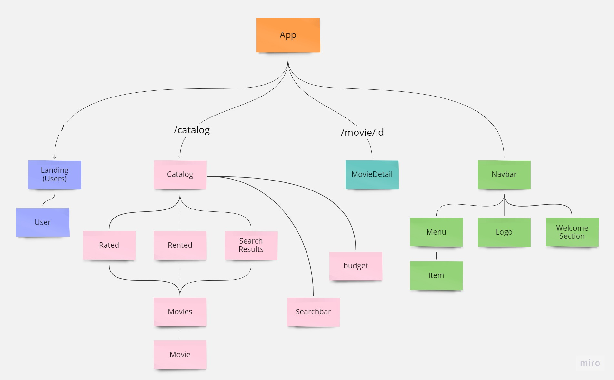
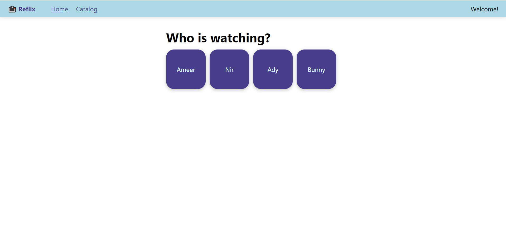
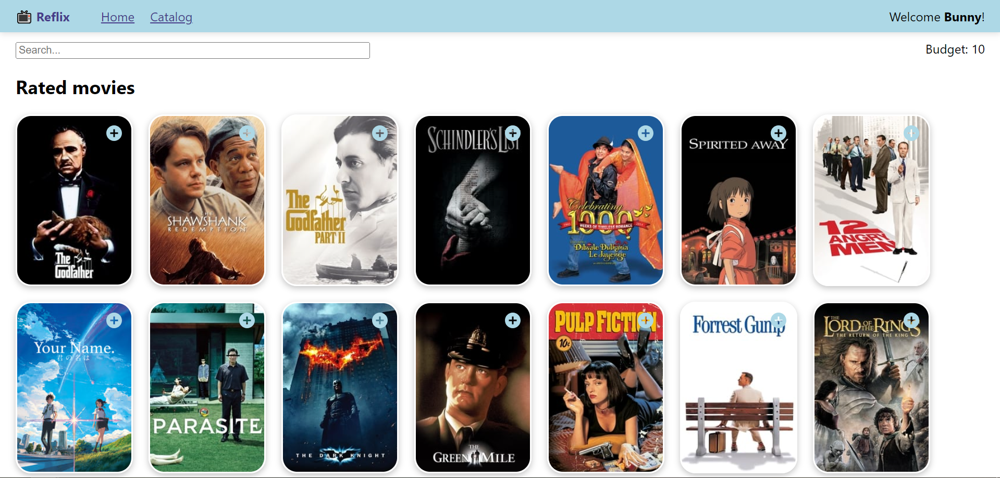
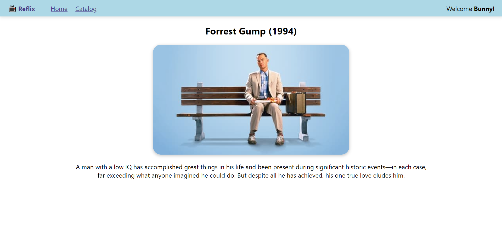
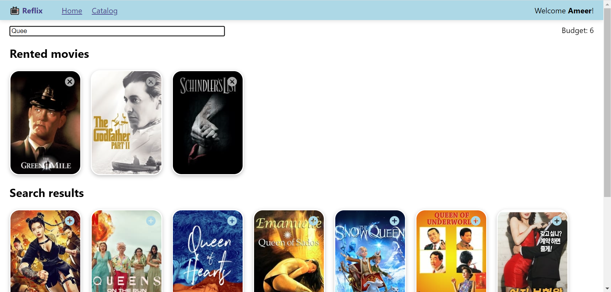

# REFLIX
Mini-project to practise REACT.JS and JS. It's one-page project that partly repeats the behaviuor of NETFLIX, as follows: allowing different users to search for movies and subscribe (rent) them.

## Table Of Contents
- [React Component Tree](#tree)
- [Screenshots](#screenthots)

## React Component Tree

## Screenshots 

    
    
    
    

