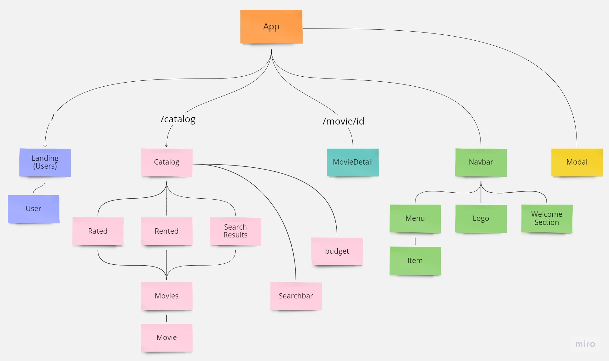

# REFLIX
Mini-project to practice using REACT.JS and JS. It's one-page project that partly repeats behavios of NETFLIX (for different users allows sarching movies and subscribing (renting) for them).

## Table Of Contents
- [React Component Tree](#tree)
- [Screenshots](#screenthots)

## React Component Tree

## Screenshots 

    
    
    
    

